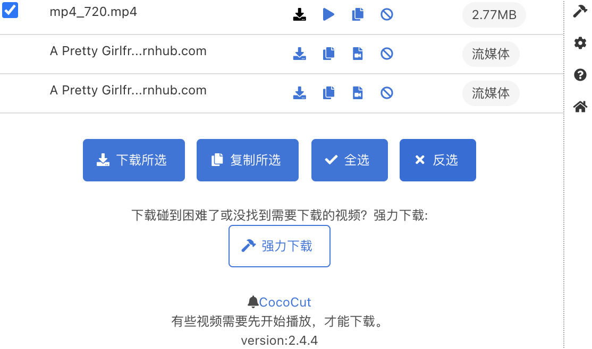
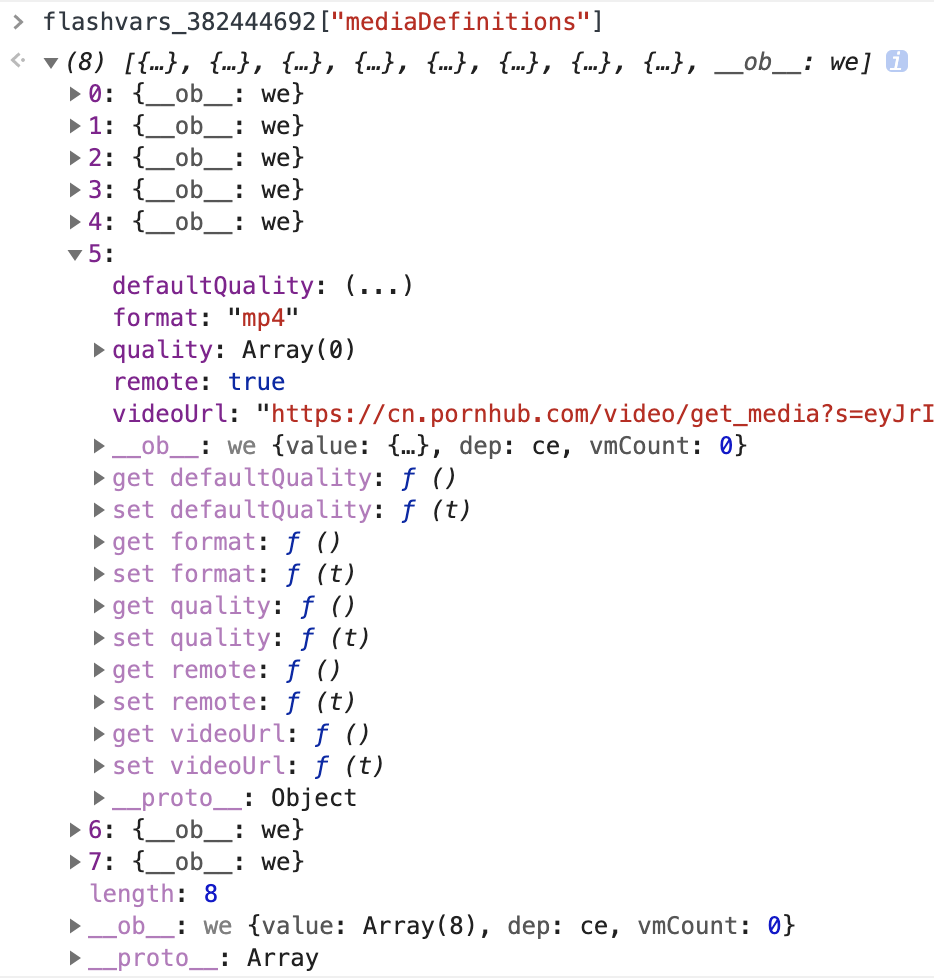
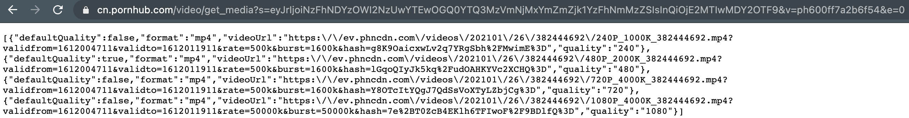
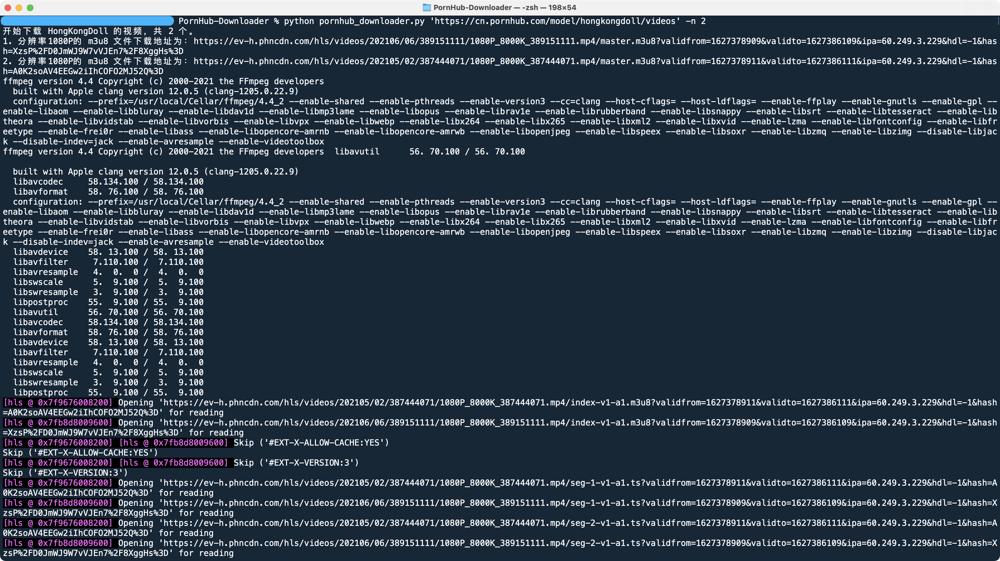

# PornHub-Downloader

基于 `Requests` 和 `FFmpeg`  的 PornHub 视频下载工具，支持多任务并行下载。


## 基于 Selenium 的下载方法

参见 [Selenium 分支](https://github.com/FrazierLei/PornHub-Downloader/tree/selenium)


## 更简单无脑的方法

可以用 IDM 这样现成的插件，或者更厉害的 CoCoCut。



具体使用方法可以参考：[在线视频抓取神器：COCOCUT——可见皆可得](https://feifeizaici.xyz/posts/cococut/)


## 为什么要下载下来？

因为如果只在线看，收藏夹里的作品经常会莫名其妙失踪，比如：


## 环境需求

- Python 3.6+

- requests: 用于下载视频

- bs4: 用于解析HTML

- ffmpy3: 用于下载并合并视频片段

  

## 原理

P站视频的信息包含在视频页面 HTML 中定义的一个 `flashvars` 开头的变量中：



下载链接包含在这个 `videoUrl`中：




如果不利用 `Selenium`，无法得到真实的 mp4 文件的下载地址，但是可以得到包含众多 ts 格式的视频片段地址的 m3u8 文件。这时我们只需要用 `FFmpeg` 把这些 ts 文件下载下来，并合并为 mp4 文件即可。


## 使用方法

1. 在环境中安装包括 `FFmpeg` 在内的众多依赖

2. 运行脚本

   ```shell
   $ python pornhub_downloader.py 'https://cn.pornhub.com/view_video.php?viewkey=xxxxxxxxxx' -s './学习资料' -n 2
   ```

   - url: 指定你感兴趣的学习资料页面或者指定 model 的主页
   - -s: 视频保存的路径，若省略，则在当前路径下的 Download 文件夹（若不存在则自动新建）
   - -n: 同时下载的进程数，默认为1


## 运行效果

支持断点续传，如果连接断开，重新运行即可。



## TODO

- [x] 去掉对 `Selenium` 的依赖
- [x] 支持多任务并行下载
- [ ] 调用其他下载软件（如迅雷）进行下载
