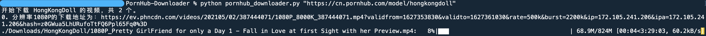

# PornHub-Downloader

目前 main 分支下的代码使用 `Asyncio` + `Aiohttp` + `Pyppeteer`，原先的旧代码保留在其他分支中。

## 为什么需要异步下载

如果下载电影时网速能够拉满的话，一个一个下和一个下完再下另一个并没有什么区别，但是很多时候因为资源服务器设在境外，下载的网速是受到很大限制的。比如你的最大下载速度是 10M/s，但是下载单个资源的最大速度是 1M/s，这样的情况下，同时下载 10 个电影能够最大效率利用你的带宽。

Asyncio 最操蛋的地方是他的 API 在每一个 Python 版本（3.4/3.5/3.7/3.10）中都有不小的变化，这就导致在各种博客、教程里你能看到各种各样的 asyncio 代码。

`Pyppeteer` 最操蛋的地方是他是 `Puppeteer` 的 Python 版本，他的选择器极其难用，不过也可能是我太笨了。所以在解析这部分我是用同步的方法去做的，这必然对整个程序的速度有些影响，但是也不大，毕竟大部分时间我们都在发请求，然后把响应写入硬盘。

