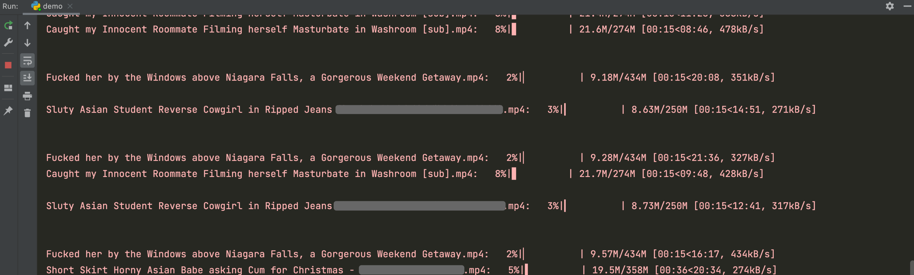

# PornHub-Downloader

基于 `Selenium`  的PornHub视频下载工具，效率一般，用于练手。


## 更简单无脑的方法

可以用 IDM 这样现成的插件，或者更厉害的 CoCoCut。


具体使用方法可以参考：[在线视频抓取神器：COCOCUT——可见皆可得](https://feifeizaici.xyz/posts/cococut/)


## 为什么要下载下来？

因为如果只在线看，收藏夹里的作品经常会莫名其妙失踪，比如：


## 原理

P站视频的信息包含在视频页面 HTML 中定义的一个 `flashvars` 开头的变量中：


下载链接包含在这个`videoUrl`中：


### 为什么会用到 Selenium？ 

因为我菜。

打开 `videoUrl` 需要一个名为 `bs` 的 cookie，但是我闹了半天也没解决，非常奇怪。

如果有能帮忙解决的大佬希望能在 issue 中指出，非常感谢！


## 环境需求

- Python 3.6+
- tqdm: 用于显示下载进度条
- requests: 用于下载视频
- bs4: 用于解析HTML
- selenium: 用于控制虚拟浏览器


## 使用方法

1. 下载和本地 Chrome 版本对应的 [chromedriver](https://chromedriver.chromium.org/)，放置在环境变量的路径中或者在脚本中指定路径

2. 运行脚本

   ```shell
   $ python pornhub_downloader.py 'https://cn.pornhub.com/view_video.php?viewkey=xxxxxxxxxx' -s './学习资料'
   ```

   - url: 指定你感兴趣的学习资料页面或者指定up主的主页
   - -s: 视频保存的路径，若省略，则在当前路径下的 Download 文件夹（若不存在则自动新建）


## 运行效果

支持断点续传，如果连接断开，重新运行即可。




## TODO

- [ ] 去掉对 `Selenium` 的依赖
- [ ] 支持多任务并行下载
- [ ] 调用其他下载软件（如迅雷）进行下载
